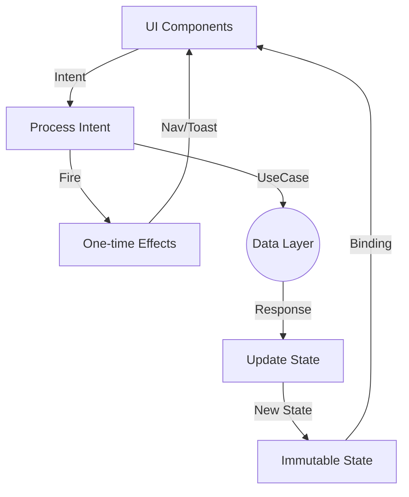
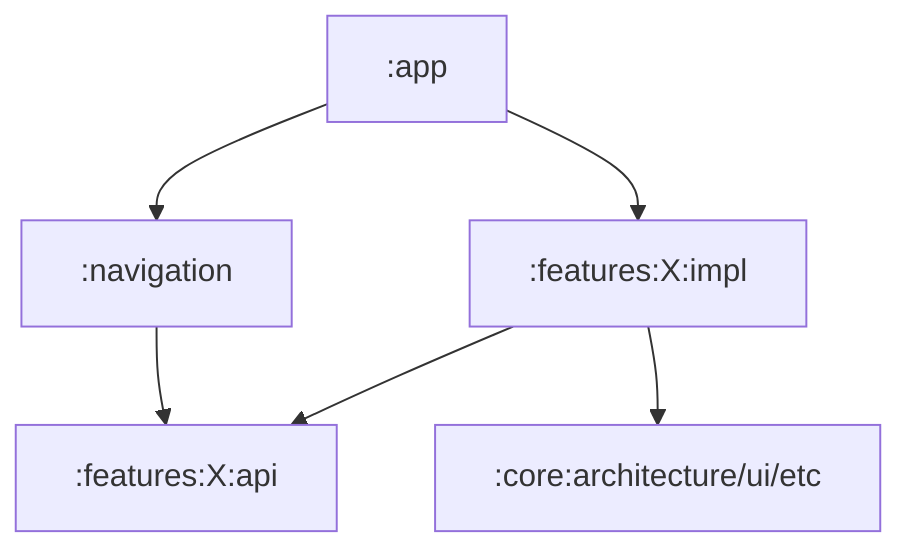

# SakaAndroid - Scalable Enterprise Android Foundation (Starter Kit)

Selamat datang di repository **SakaAndroid Starter Kit**. Proyek ini merupakan **fondasi arsitektur Android tingkat enterprise** yang dibangun dengan standar industri tinggi, dirancang khusus sebagai titik awal (template) yang bersih untuk membangun aplikasi baru.

## 📝 Ringkasan Fondasi
Fondasi ini dirancang untuk menyelesaikan tantangan umum dalam pengembangan aplikasi skala besar, seperti manajemen state yang kompleks, modularisasi yang sulit dipelihara, dan performa UI.

### Key Capabilities:
- **Saka Design System:** Sistem UI terpusat dengan komponen yang Figma-compliant.
- **Modularization Engine:** Struktur modul `:api` (kontrak) dan `:impl` (detail) yang optimal.
- **Enterprise Security:** Implementasi `SecurityGuard` terintegrasi.
- **Predictable Robustness:** Arsitektur MVI untuk konsistensi state UI.

---

## 📊 Alur Arsitektur MVI
Diagram ini menjelaskan siklus *Unidirectional Data Flow* (UDF).

---

## 📦 Struktur Modul & Dependensi
SakaAndroid menggunakan struktur **Multi-module** tingkat lanjut.

---

## 🚀 Quick Start
1. **Clone:** `git clone -b starter-project https://github.com/muharifandi/compose-mvi.git`
2. **Setup:** Gunakan Android Studio Ladybug (2024.2.1) atau lebih baru.
3. **Build:** Jalankan `./gradlew assembleDebug`.
4. **Docs:** Baca [Architecture Guide](docs/architecture.md).

---

## 🏗 Arsitektur Utama
Proyek ini mengadopsi standar **Modern Android Development (MAD)**:
- **Modularization:** API/Impl split strategy.
- **Clean Architecture:** Separation of Concerns.
- **MVI Pattern:** Reactive & Predictable UI.

---

## 📖 Dokumentasi Lengkap (Starter Kit)
| Dokumen | Deskripsi |
| :--- | :--- |
| [Architecture](docs/architecture.md) | Detail Clean Architecture & Data Flow. |
| [Design System](docs/ui-component-guide.md) | Katalog komponen UI Saka. |
| [Modularization](docs/modularization.md) | Struktur modul & aturan dependency. |
| [MVI Guide](docs/mvi-architecture.md) | Panduan State, Intent, & Effect. |
| [Standards](docs/engineering-standards.md) | Aturan coding & workflow. |
| [Feature Guide](docs/feature-development.md) | Panduan membuat fitur baru. |
| [App Lifecycle](docs/app-lifecycle.md) | Alur aplikasi (Splash -> Auth). |
| [Testing Guide](docs/testing-guide.md) | Strategi pengujian. |

---

## 🛠 Tech Stack
- **UI:** Jetpack Compose, Material 3
- **Network:** Retrofit, OkHttp
- **DI:** Hilt (Dagger)
- **Quality:** JUnit 5, MockK, Turbine

---
**Created by:** Muh. Arifandi  
**Email:** arif76440@gmail.com
