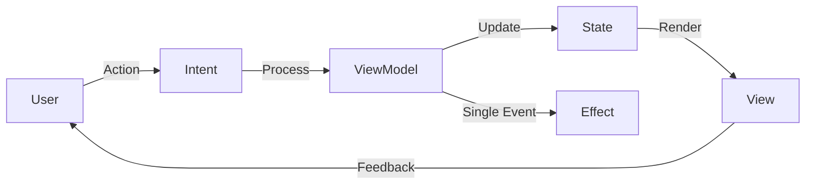

# My Application - Android Starter Foundation

Proyek ini adalah foundation Android modular tingkat enterprise yang dibangun dengan prinsip Clean Architecture, MVI, dan Jetpack Compose. Dirancang untuk skalabilitas tim besar dan pemeliharaan jangka panjang, mengikuti standar resmi **Google "Now in Android" (NiA)**.

---

## 🛠️ Setup Awal

Kami menggunakan standar `.env` (melalui file `config.env`) untuk manajemen konfigurasi dan rahasia aplikasi agar proses *onboarding* tim lebih mudah dan terstandarisasi.

1.  **Clone** repositori ini.
2.  Pastikan file **`config.env`** ada di root direktori proyek (atau buat baru jika belum ada).
3.  Tambahkan konfigurasi berikut ke dalam file `config.env`:
    ```env
    # API Config
    NEWS_API_KEY=isi_dengan_api_key_anda
    BASE_URL=https://newsapi.org/v2/

    # App Metadata
    APP_ID=com.muh.arifandi.dicoding
    MIN_SDK=23
    TARGET_SDK=35
    VERSION_CODE=1
    VERSION_NAME=1.0.0
    ```
4.  **Sync Project** dengan Gradle Files dan jalankan aplikasi.

---

## 🏗️ Visualisasi Arsitektur (Google NiA Standard)

Proyek ini menggunakan **Feature-Oriented Modular Architecture**. Setiap fitur diisolasi untuk memastikan performa build yang cepat dan mencegah "Spaghetti Code".

### Struktur Modul
*   **`:app`**: Modul utama (Entry Point) yang menghubungkan semua fitur, menyediakan `MainActivity`, inisialisasi Hilt, dan konfigurasi navigasi global.
*   **`:features:*`**: Berisi logika bisnis per fitur. Contoh: `:features:news` menangani pengambilan berita, bookmark, dan detail.
*   **`:core:*`**: Modul infrastruktur yang reusable:
    *   `:core:network`: Konfigurasi Retrofit, OkHttp, Interceptor, dan penanganan error API secara tersentralisasi.
    *   `:core:ui`: **Design System** aplikasi (Theme, Reusable Composables, Icons, Resources).
    *   `:core:common`: Utility umum, `ResultState`, base classes, dan extensions.
*   **`:navigation`**: Sentralisasi rute navigasi menggunakan Type-Safe Navigation Compose.

---

### 🔄 Alur Kerja MVI (Model-View-Intent)

Aplikasi ini menerapkan pola **MVI** dengan aliran data satu arah (**Unidirectional Data Flow**) untuk menjamin *predictability* dari state UI.

1.  **Intent**: User melakukan aksi (misal: mengetik di search bar). UI mengirim `Intent` ke `ViewModel`.
2.  **Model (State)**: `ViewModel` memproses `Intent` (memanggil Use Case/Repository), lalu menghasilkan `State` baru yang bersifat *immutable*.
3.  **View**: UI mengobservasi `State` melalui `StateFlow` dan melakukan *recomposition* secara otomatis saat state berubah.
4.  **Effect**: Untuk aksi satu kali (seperti navigasi atau menampilkan Toast), kami menggunakan `SideEffect` agar tidak mengotori state utama.



---

## 🚀 Perbaikan Terbaru

Baru-baru ini dilakukan optimasi pada sistem jaringan:
*   **Centralized Error Handling**: Memastikan error API (401, 429, dll) tertangkap dengan benar oleh `SafeApiCall` dan ditampilkan di UI.
*   **Interceptor Optimization**: Logging interceptor diposisikan setelah Auth interceptor agar developer dapat memverifikasi API Key yang dikirim melalui header `X-Api-Key`.
*   **Type-Safe News API**: Refaktor `NewsApiService` untuk mempermudah deteksi kegagalan request melalui exception handling yang lebih bersih.

---

## 📚 Dokumentasi Engineering

1.  [**Project Overview**](docs/engineering/01-overview.md) - Filosofi dan tujuan skalabilitas.
2.  [**Architecture & Structure**](docs/engineering/02-architecture.md) - Detail modul dan arah dependensi.
3.  [**MVI & Data Flow**](docs/engineering/03-mvi-flow.md) - Panduan manajemen state.
4.  [**Feature Development Guide**](docs/engineering/04-development-guide.md) - Cara menambah fitur baru.

---
**Created by Muh. Arifandi**
Email: [arif76440@gmail.com](mailto:arif76440@gmail.com)
