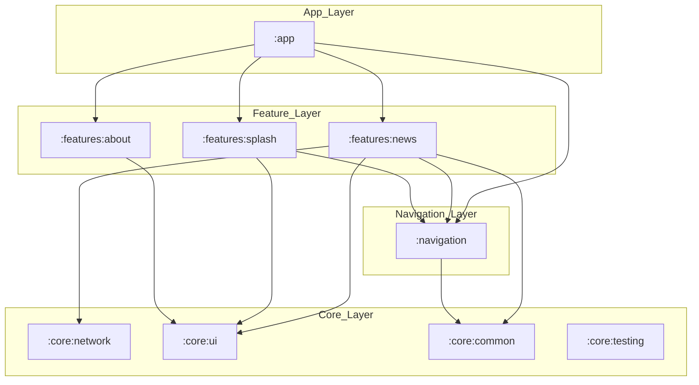
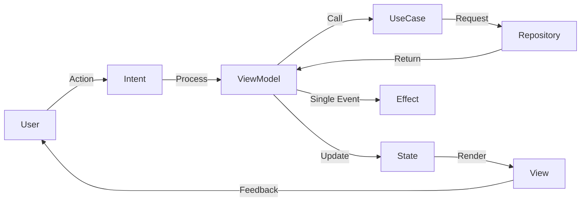

# My Application - Android Starter Foundation

Proyek ini adalah foundation Android modular tingkat enterprise yang dibangun dengan prinsip Clean Architecture, MVI, dan Jetpack Compose. Dirancang untuk skalabilitas tim besar dan pemeliharaan jangka panjang, mengikuti standar resmi **Google "Now in Android" (NiA)**.

---

## 🛠️ Setup Awal

Kami menggunakan standar `.env` (melalui file `config.env`) untuk manajemen konfigurasi dan rahasia aplikasi agar proses *onboarding* tim lebih mudah dan terstandarisasi.

1.  **Clone** repositori ini.
2.  Pastikan file **`config.env`** ada di root direktori proyek (atau buat baru jika belum ada).
3.  Tambahkan konfigurasi berikut ke dalam file `config.env`:
    ```env
    # API Config
    NEWS_API_KEY=isi_dengan_api_key_anda
    BASE_URL=https://newsapi.org/v2/

    # App Metadata
    APP_ID=com.muh.arifandi.dicoding
    MIN_SDK=23
    TARGET_SDK=35
    VERSION_CODE=1
    VERSION_NAME=1.0.0
    ```
4.  **Sync Project** dengan Gradle Files dan jalankan aplikasi.

---

## 🏗️ Visualisasi Arsitektur (Full Dependency Graph)

Proyek ini menggunakan **Feature-Oriented Modular Architecture**. Setiap fitur diisolasi untuk memastikan performa build yang cepat dan mencegah "Spaghetti Code".

### 1. Graf Dependensi Modul Lengkap


### 2. Lapisan di Dalam Fitur (Internal Clean Architecture)
Setiap modul fitur memiliki struktur internal yang konsisten:
- **`ui`**: Compose UI & MVI ViewModel.
- **`domain`**: Use Cases & Repository Contract.
- **`data`**: API Services, Room DB, DTOs, & Repository Implementation.

---

### 🔄 Alur Kerja MVI (Model-View-Intent)

Aplikasi ini menerapkan pola **MVI** dengan aliran data satu arah (**Unidirectional Data Flow**) untuk menjamin *predictability* dari state UI.



---

## 🚀 Perbaikan Terbaru

Baru-baru ini dilakukan optimasi pada sistem jaringan dan dokumentasi:
*   **Centralized Error Handling**: Menggunakan `SafeApiCall` untuk menangani error API secara seragam (401, 429, 500) dan menampilkannya di UI.
*   **Interceptor Optimization**: Logging interceptor kini mencatat request setelah otentikasi header `X-Api-Key` disuntikkan.
*   **Type-Safe News API**: Refaktor service API untuk mempermudah deteksi kegagalan melalui exception handling yang lebih bersih.
*   **CI/CD Foundation**: Struktur proyek telah disiapkan untuk mendukung integrasi berkelanjutan (Continuous Integration).

---

## 📚 Dokumentasi Engineering

1.  [**Project Overview**](docs/engineering/01-overview.md) - Filosofi dan tujuan skalabilitas.
2.  [**Architecture & Structure**](docs/engineering/02-architecture.md) - Detail modul dan arah dependensi.
3.  [**MVI & Data Flow**](docs/engineering/03-mvi-flow.md) - Panduan manajemen state.
4.  [**Feature Development Guide**](docs/engineering/04-development-guide.md) - Cara menambah fitur baru.

---
**Created by Muh. Arifandi**
Email: [arif76440@gmail.com](mailto:arif76440@gmail.com)
