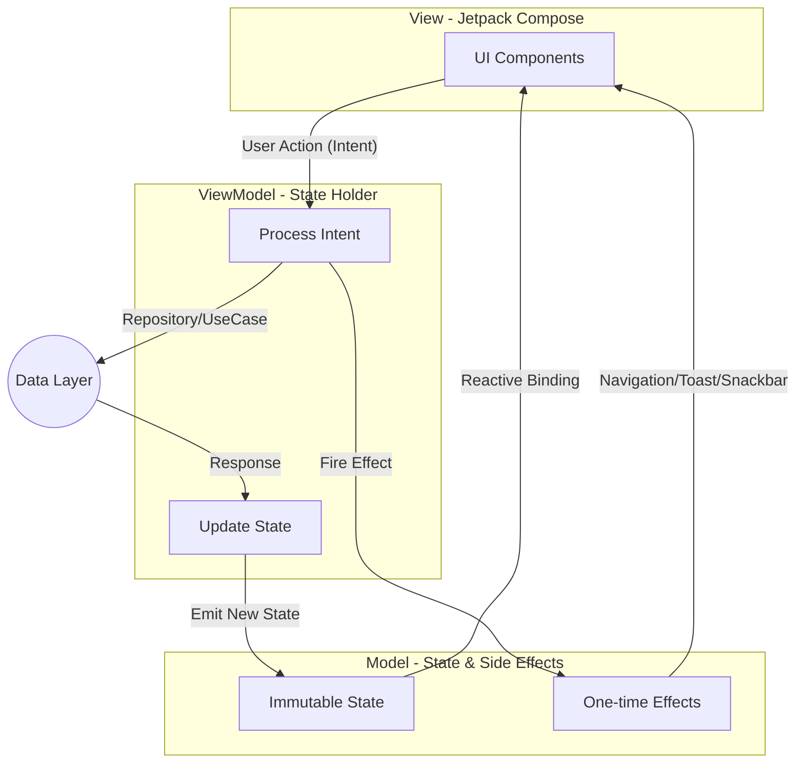
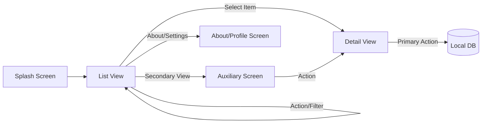

# SakaAndroid - Scalable Enterprise Android Foundation

Selamat datang di repository **SakaAndroid**. Proyek ini merupakan **fondasi arsitektur Android tingkat enterprise** yang dibangun dengan standar industri tinggi. Dirancang sebagai *boilerplate* modular yang skalabel, proyek ini menggunakan **Clean Architecture**, **pola MVI (Model-View-Intent)**, dan **Jetpack Compose** untuk mendukung pengembangan berbagai jenis aplikasi Android modern dengan efisiensi tinggi.

## 📝 Ringkasan Fondasi
Fondasi ini dirancang untuk menyelesaikan tantangan umum dalam pengembangan aplikasi skala besar, seperti manajemen state yang kompleks, modularisasi yang sulit dipelihara, dan performa UI. Secara teknis, proyek ini menyediakan implementasi standar untuk **Offline-First**, **Modularisasi tingkat lanjut (API/Impl split)**, serta sistem navigasi yang terdesentralisasi.

### Key Capabilities:
- **Modularization Engine:** Struktur modul `:api` (kontrak) dan `:impl` (detail) yang mengoptimalkan kecepatan build dan enkapsulasi fitur.
- **Enterprise Security:** Implementasi `SecurityGuard` terintegrasi untuk deteksi Root, Emulator, dan Debug secara *out-of-the-box*.
- **High Performance Foundation:** Integrasi *Baseline Profile* dan *Paging 3* yang siap digunakan untuk pengalaman UI tanpa hambatan.
- **Predictable Robustness:** Arsitektur MVI yang menjamin konsistensi state UI dan kemudahan pengujian otomatis (Unit/UI Testing).

---

## 📊 Alur Arsitektur MVI (Technical Flow)
Diagram ini menjelaskan siklus *Unidirectional Data Flow* (UDF) yang menjadi standar manajemen state dalam fondasi ini.

---

## 🛠 Contoh Implementasi Alur Bisnis (Example Flow)
Diagram fungsional yang menjelaskan bagaimana fondasi ini menangani perjalanan pengguna dalam sebuah aplikasi (Contoh: Fitur Berita).

---

## 🚀 Quick Start
1. **Clone:** `git clone https://github.com/muharifandi/compose-mvi.git`
2. **Setup:** Gunakan Android Studio Ladybug (2024.2.1) atau lebih baru.
3. **Build:** Jalankan `./gradlew assembleDebug`.
4. **Docs:** Baca [Onboarding Guide](docs/onboarding-guide.md) untuk memulai pengembangan fitur baru.

## 🏗 Arsitektur Utama
Proyek ini mengadopsi standar **Modern Android Development (MAD)** dengan pilar utama:
- **Modularization:** API/Impl split strategy untuk enkapsulasi dan build time yang optimal.
- **Clean Architecture:** Pemisahan tanggung jawab yang jelas antara layer Presentation, Domain, dan Data.
- **MVI Pattern:** Pola arsitektur yang menjamin *Unidirectional Data Flow* (UDF) dan state yang konsisten.

### Alur MVI (Model-View-Intent):
1. **Intent:** Merepresentasikan aksi pengguna (contoh: klik tombol, refresh halaman).
2. **Model (State):** Satu-satunya sumber kebenaran (Single Source of Truth) untuk UI yang bersifat immutable.
3. **View:** Jetpack Compose yang merepresentasikan State secara reaktif.
4. **Effect:** Side-effect satu kali (one-time events) seperti navigasi, toast, atau snackbar.

---

## 📚 Referensi & Standar Pengembangan
Pengembangan proyek ini merujuk pada standar industri dan dokumentasi resmi berikut:
- **[Guide to App Architecture](https://developer.android.com/topic/architecture):** Panduan resmi Google untuk arsitektur aplikasi Android yang skalabel.
- **[Now in Android (NiA)](https://github.com/android/nowinandroid):** Project referensi resmi Google untuk implementasi modularisasi dan tech stack terbaru.
- **[Kotlin Coroutines & Flow](https://kotlinlang.org/docs/coroutines-overview.html):** Standar manajemen asinkron dan reaktif di Kotlin.
- **[Jetpack Compose Guidelines](https://developer.android.com/jetpack/compose/architecture):** Praktik terbaik dalam pengembangan UI deklaratif.
- **[MVI Architecture (Orbit/MVICore)](https://github.com/orbit-mvi/orbit-mvi):** Referensi pola MVI yang stabil dan terprediksi.

---

## 📖 Dokumentasi Lengkap
Kami menyediakan dokumentasi teknis mendalam untuk setiap aspek:
| Dokumen | Deskripsi |
| :--- | :--- |
| [Architecture](docs/architecture.md) | Detail Clean Architecture & Layering. |
| [Modularization](docs/modularization.md) | Struktur modul & Dependency Graph. |
| [MVI Guide](docs/mvi-architecture.md) | Panduan State, Intent, & Effect. |
| [Engineering Standards](docs/engineering-standards.md) | Coding style & Best practices. |
| [Feature Guide](docs/feature-development.md) | Panduan membuat fitur & modul baru. |
| [Testing Guide](docs/testing-guide.md) | Strategi pengujian & QA. |
| [Security Guide](docs/architecture-governance.md) | Tata kelola & Aturan arsitektur. |

## 🛠 Tech Stack
- **UI:** Jetpack Compose, Material 3
- **Network:** Retrofit, OkHttp, Kotlin Serialization
- **Database:** Room, Paging 3
- **DI:** Hilt (Dagger)
- **Image:** Coil
- **Quality:** Detekt, JUnit 5, MockK, Turbine

---
**Created by:** Muh. Arifandi  
**Email:** arif76440@gmail.com
