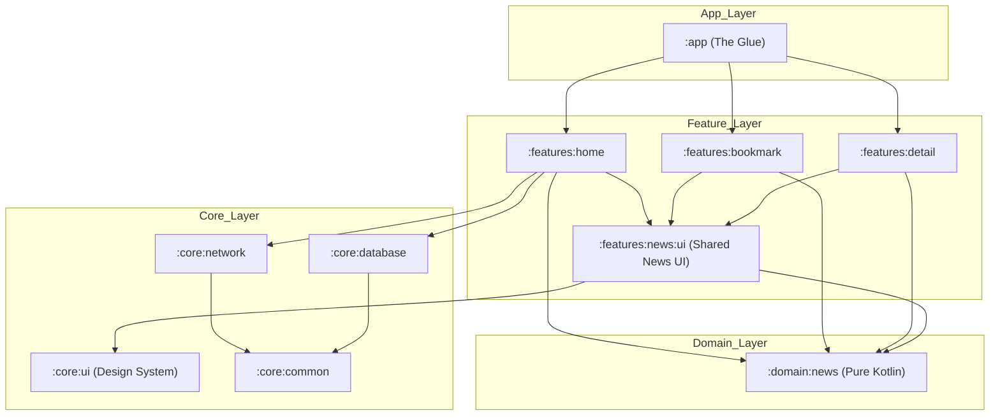
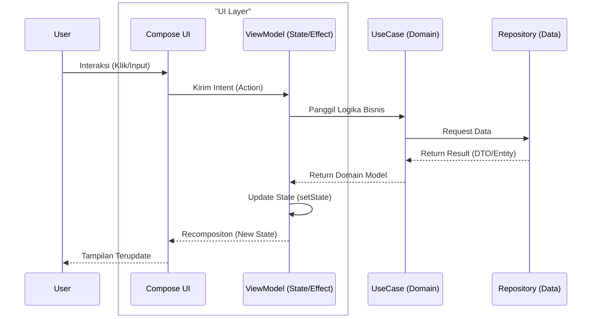

# My Application - Android Starter Foundation

Proyek ini adalah foundation Android modular tingkat enterprise yang dibangun dengan prinsip Clean Architecture, MVI, dan Jetpack Compose. Dirancang untuk skalabilitas tim besar dan pemeliharaan jangka panjang.

---

## 🛠️ Setup Awal

Kami menggunakan standar `.env` untuk manajemen rahasia aplikasi agar proses *onboarding* tim lebih mudah dan terstandarisasi.

1.  **Clone** repositori ini.
2.  Buat file baru bernama **`.env`** di root direktori proyek.
3.  Tambahkan konfigurasi berikut ke dalam file `.env`:
    ```env
    NEWS_API_KEY=isi_dengan_api_key_anda
    BASE_URL=https://newsapi.org/v2/
    ```
4.  **Sync Project** dengan Gradle Files dan jalankan aplikasi.

---

## 🏗️ Visualisasi Arsitektur

Proyek ini menggunakan **Feature-Oriented Modular Architecture**. Setiap fitur diisolasi untuk memastikan performa build yang cepat dan mencegah "Spaghetti Code".

### 1. Graf Dependensi Modul
Berikut adalah struktur bagaimana modul-modul saling terhubung:



### 2. Alur Data MVI (Unidirectional Data Flow)
Kami menjamin konsistensi UI melalui aliran data satu arah:



---

## 📚 Dokumentasi Engineering

Kami menyediakan panduan mendalam untuk setiap bagian arsitektur:

1.  [**Project Overview**](docs/engineering/01-overview.md) - Filosofi dan tujuan skalabilitas.
2.  [**Architecture & Structure**](docs/engineering/02-architecture.md) - Detail modul dan arah dependensi.
3.  [**MVI & Data Flow**](docs/engineering/03-mvi-flow.md) - Panduan manajemen state.
4.  [**Feature Development Guide**](docs/engineering/04-development-guide.md) - Cara menambah fitur baru (Step-by-step).
5.  [**Deep Dive Dependencies**](docs/engineering/05-dependencies-deep-dive.md) - Penjelasan library & plugin dengan analogi.
6.  [**Onboarding Guide**](docs/engineering/06-onboarding.md) - Standar penamaan dan workflow Git.
7.  [**Testing Strategy**](docs/engineering/07-testing.md) - Unit Test, UI Test, dan Robot Pattern.

---

## 🚀 Fitur Utama
- **Fully Modular**: Isolasi kode antar fitur untuk performa build maksimal.
- **Clean Architecture**: Pemisahan tanggung jawab yang ketat (Data, Domain, Presentation).
- **MVI Architecture**: State management yang *predictable* dan mudah di-debug.
- **Design System**: Komponen UI yang reusable di `:core:ui`.
- **Centralized Config**: Cukup kelola satu file `.env` untuk seluruh project.
- **Unit & UI Testing**: Siap dengan MockK, Turbine, dan Robot Pattern.

---
**Created by Muh. Arifandi**
Email: [arif76440@gmail.com](mailto:arif76440@gmail.com)
