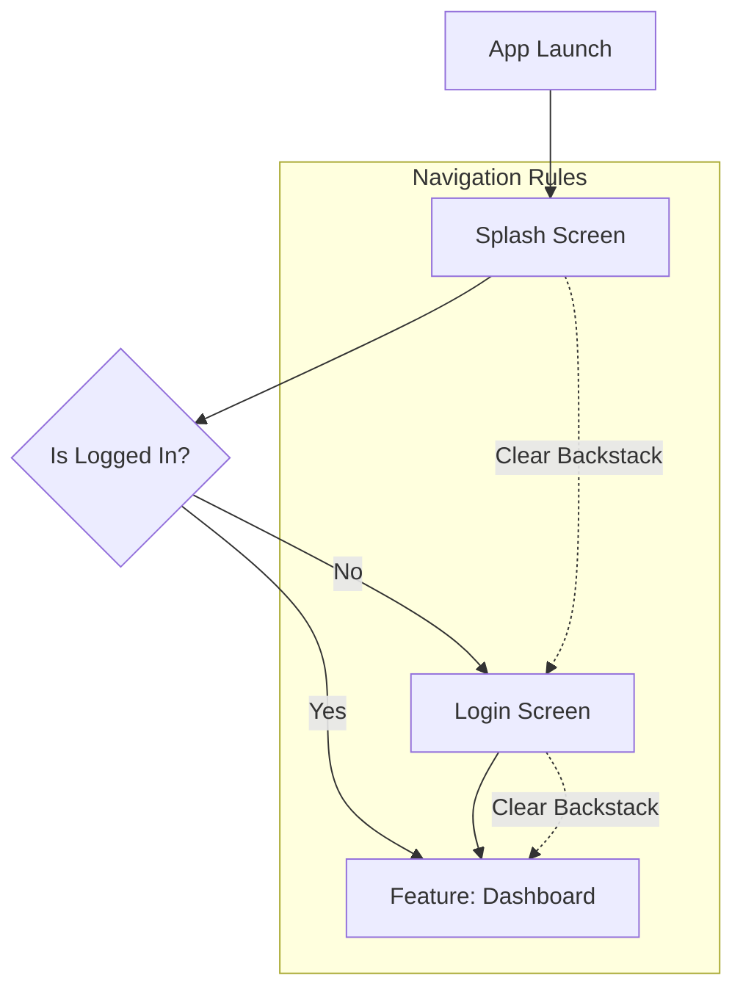

# Lifecycle & Application Flow 🔄

Dokumen ini menjelaskan alur hidup aplikasi SakaAndroid dari saat diluncurkan hingga ditutup, serta bagaimana navigasi antar fitur dikelola secara terpusat.

## 1. Alur Visual Navigasi (Visual Flow)

Berikut adalah diagram transisi layar utama dalam aplikasi:

---

## 2. Fase Lifecycle Aplikasi

### Fase 1: Inisialisasi (Startup)
1.  **Application Class**: Hilt melakukan inisialisasi Dependency Injection.
2.  **MainActivity.onCreate()**: 
    - `installSplashScreen()` dipanggil untuk transisi smooth dari sistem.
    - `enableEdgeToEdge()` diaktifkan untuk tampilan full screen.
    - `SecurityGuard` mengecek integritas aplikasi (Root check, Debug check).

### Fase 2: Splash & Routing
1.  **SplashScreen**: Mengecek logic bisnis (misal: apakah user sudah login?).
2.  **Navigation Decision**: Berdasarkan state di atas, aplikasi akan mengarahkan user ke rute yang sesuai (Login atau Dashboard).

### Fase 3: Main Flow (Features)
- Setelah login, user masuk ke alur utama aplikasi.
- Navigasi antar fitur dilakukan secara *distributed* melalui `FeatureApi`.
- Insets (Padding System Bar) dikelola secara otomatis oleh `SakaScaffold`.

---

## 3. Mekanisme Navigasi Teknis

Aplikasi ini menggunakan pola **Distributed Navigation**:

1.  **API Module**: Mendefinisikan rute (misal: `NewsDestinations`).
2.  **IMPL Module**: Mengimplementasikan `FeatureApi` untuk mendaftarkan rute tersebut ke NavGraph.
3.  **App Module**: Melalui `AppNavHost`, mengumpulkan semua `FeatureApi` yang terdaftar via Hilt Multibinding dan menyatukannya dalam satu `NavHost`.

### Keuntungan:
- **Modular**: Modul fitur tidak perlu tahu keberadaan modul fitur lain.
- **Type-Safe**: Mengirim data menggunakan class, bukan string URL manual.
- **Centralized Management**: Side effect navigasi (seperti dari ViewModel) dikelola oleh `NavigationManager`.

---

## 4. Penutupan (Termination)
Aplikasi akan ditutup jika:
- User menekan tombol Back pada layar utama (Home).
- `SecurityGuard` mendeteksi ancaman keamanan dan memanggil `finish()`.
- Sistem melakukan *process death* untuk menghemat memori.
