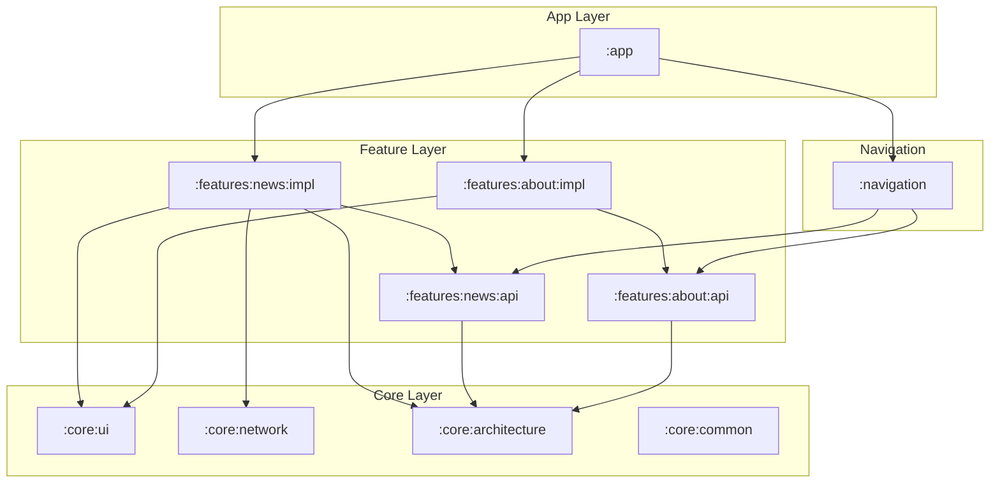

# Dependency Graph & Module Relationship

Dokumen ini menjelaskan hubungan antar modul dan arah ketergantungan untuk menjaga arsitektur tetap bersih.

## 1. Diagram Hubungan Modul (High Level)

---

## 2. Aturan Emas Dependency
1. **Piramida Terbalik:** Modul di lapisan atas (`:app`, `:features:impl`) boleh tahu tentang modul di bawahnya (`:core`, `:api`), tapi modul di bawah tidak boleh tahu tentang modul di atas.
2. **API vs Impl:** Modul luar hanya boleh bergantung pada `:api`. Hanya modul `:app` yang boleh bergantung pada `:impl` untuk keperluan Dependency Injection.
3. **No Circularity:** Modul A tidak boleh bergantung pada modul B jika B sudah bergantung pada A.

---

## 3. Strategi Modularisasi Skalabel
Untuk menghindari grafik dependensi yang terlalu lebar (*flat*) atau terlalu dalam (*deep*), kami menerapkan:
- **Feature Grouping:** Modul fitur dikelompokkan berdasarkan domain bisnis.
- **Shared Libraries:** Kode yang benar-benar global diletakkan di modul `:core`.

---

## 4. Kesimpulan
Dengan menjaga grafik dependensi tetap bersih (DAG - Directed Acyclic Graph), kita memastikan waktu kompilasi yang optimal dan mempermudah pengujian modul secara isolasi.
