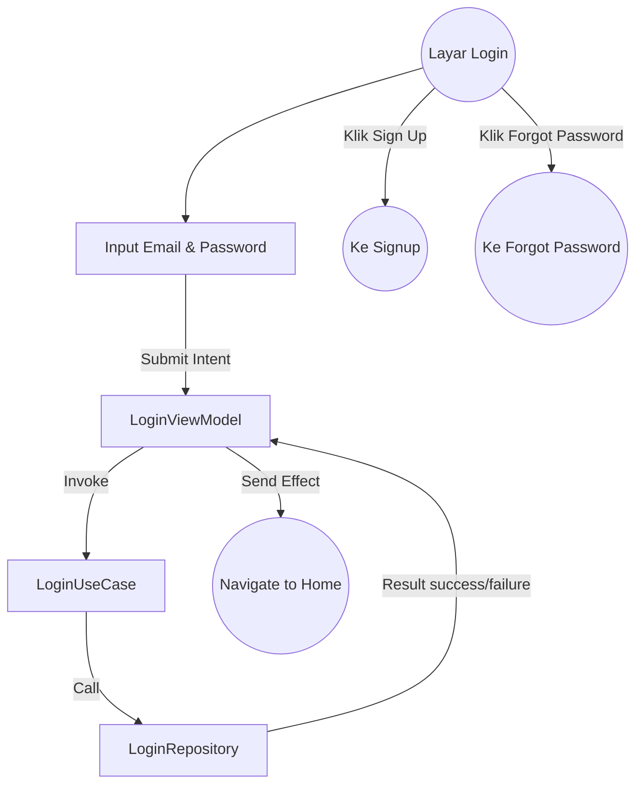
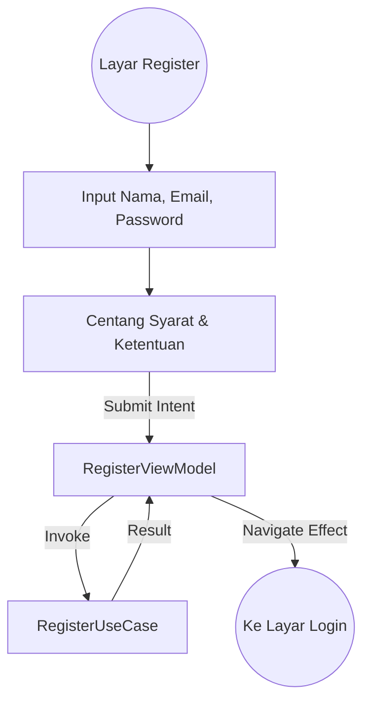

# Dokumentasi Fitur - Authentication (Login & Signup)

Modul ini menangani proses otentikasi pengguna untuk masuk atau mendaftar akun baru menggunakan pola **Clean Architecture**.

## Arsitektur Fitur
*   **Domain**: `LoginUseCase`, `RegisterUseCase`.
*   **Data**: `LoginRepositoryImpl`, `RegisterRepositoryImpl`.
*   **Presentation**: `LoginViewModel`, `RegisterViewModel` (MVI).

## 1. Login Screen
Menangani akses pengguna lama ke dalam aplikasi.
* **Input**: Email & Password.
* **Validasi**: Tombol aktif jika kedua field terisi.
* **Flow**: UI -> Intent -> ViewModel -> UseCase -> Repository -> Result.

### Alur Login (Interaction & Data Flow)

---

## 2. Signup (Register) Screen
Menangani pendaftaran akun pengguna baru.
* **Input**: Nama Lengkap, Email, Password.
* **Syarat**: Centang Syarat & Ketentuan (Terms & Conditions).
* **Validasi**: Tombol aktif jika data lengkap & T&C dicentang.

### Alur Signup (Data Flow)

## Pengiriman Data & Keamanan
*   Semua data otentikasi dikirim melalui `Result<Unit>` untuk penanganan error yang aman.
*   Password tidak pernah disimpan secara plain text di layer data.
