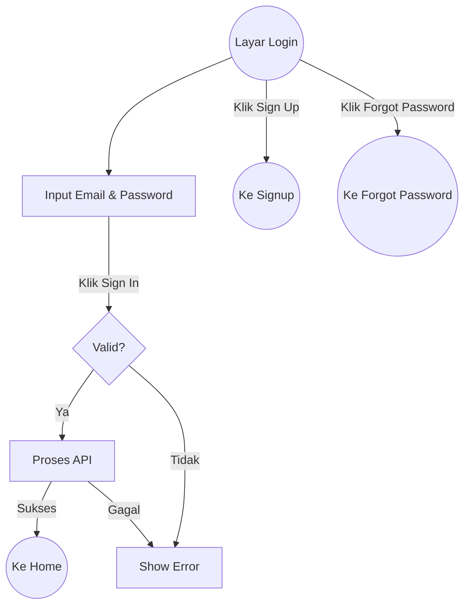
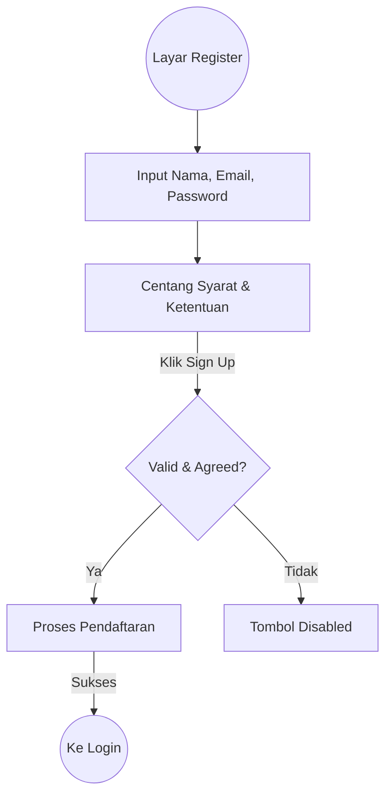

# Dokumentasi Fitur - Authentication (Login & Signup)

Modul ini menangani proses otentikasi pengguna untuk masuk atau mendaftar akun baru.

## 1. Login Screen
Menangani akses pengguna lama ke dalam aplikasi.
* **Input**: Email & Password.
* **Validasi**: Tombol aktif jika kedua field terisi.
* **Navigasi**: Pindah ke Home jika sukses, atau ke Signup/Forgot Password.

### Alur Login

---

## 2. Signup (Register) Screen
Menangani pendaftaran akun pengguna baru.
* **Input**: Nama Lengkap, Email, Password.
* **Syarat**: Centang Syarat & Ketentuan (Terms & Conditions).
* **Validasi**: Tombol aktif jika data lengkap & T&C dicentang.

### Alur Signup

