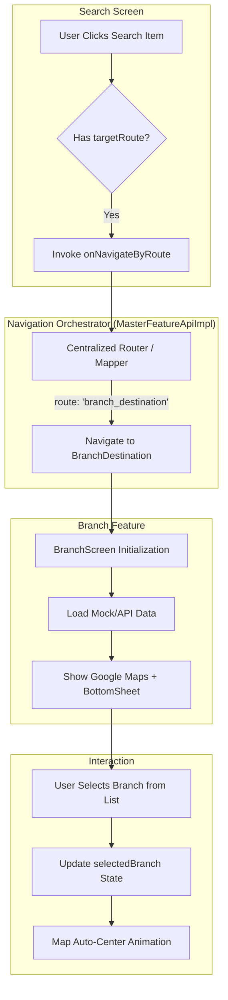

# 🏦 Feature: Branch (Lokasi Cabang)

Dokumentasi ini menjelaskan implementasi fitur Branch yang mencakup integrasi Google Maps, arsitektur MVI, dan mekanisme navigasi dinamis berbasis Server-Driven UI (SDUI).

---

## 🏗️ Arsitektur

Fitur ini mengikuti arsitektur **MVI (Model-View-Intent)** dengan pemisahan layer yang ketat untuk skalabilitas dan testability.

### Komponen Utama:
- **`BranchModel`**: Entity domain yang menyimpan data koordinat, nama, dan alamat cabang.
- **`BranchViewModel`**: Mengelola logika bisnis, filter pencarian, dan pembaruan posisi kamera peta.
- **`BranchScreen`**: UI layer menggunakan Jetpack Compose, Google Maps SDK, dan BottomSheet untuk daftar cabang.

---

## 🗺️ Visual Graph & Alur Navigasi

### Alur Navigasi Dinamis (SDUI)
Aplikasi menggunakan pola **Centralized Router** untuk menangani navigasi dari Search ke Branch tanpa hardcoding.



---

## 🚀 Mekanisme Navigasi (Type-Safe)

Fitur ini menggunakan **Type-Safe Navigation** yang diperkenalkan pada Compose Navigation 2.8.0+.

1. **Contract**: `BranchDestination` didefinisikan di modul `:features:master:api`.
2. **Registration**: Didaftarkan di `MasterFeatureApiImpl.kt`.
3. **Execution**:
   ```kotlin
   // Di MasterFeatureApiImpl
   when (route) {
       "branch_destination" -> navController.navigate(BranchDestination)
   }
   ```

---

## 🛠️ Konfigurasi Google Maps

Fitur ini menggunakan API Key yang dikelola secara aman melalui file `.env`.

- **Library**: `com.google.maps.android:maps-compose`
- **Security**: API Key disuntikkan via `manifestPlaceholders` di `build.gradle.kts`.
- **Permissions**: Saat ini menggunakan data mock, namun siap untuk `ACCESS_FINE_LOCATION` untuk fitur "User Location".

---

## 📈 Roadmap Pengembangan
- [x] Integrasi Google Maps Asli.
- [x] Navigasi Dinamis (SDUI).
- [x] Auto-center camera pada pemilihan cabang.
- [ ] Integrasi API Backend sungguhan.
- [ ] Fitur rute (Direction API) dari lokasi user ke cabang.
- [ ] Custom Info Window pada Marker.

---
*Dibuat oleh: Principal Android Engineer*
