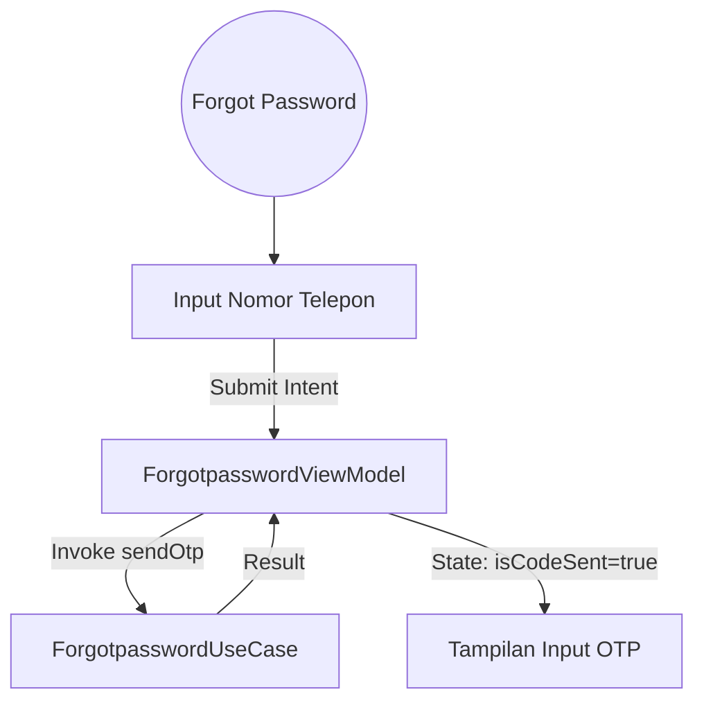
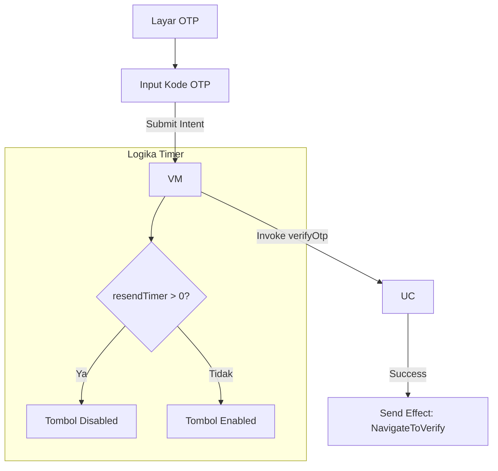
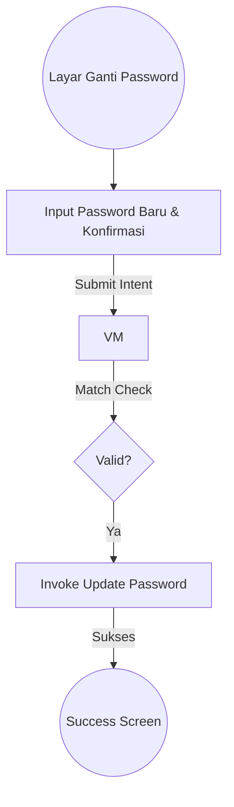

# Dokumentasi Fitur - Forgot Password & OTP Flow

Alur pemulihan akun yang mencakup verifikasi nomor telepon melalui kode OTP menggunakan standar arsitektur Clean.

## Arsitektur Fitur
*   **UseCase**: `ForgotpasswordUseCase` (Metode: `sendOtp`, `verifyOtp`).
*   **Repository**: `ForgotpasswordRepository`.
*   **ViewModel**: `ForgotpasswordViewModel` (MVI).

## 1. Forgot Password (Phone Input)
Pengguna memasukkan nomor telepon untuk menerima kode verifikasi.

### Alur Data

## 2. OTP Verification & Resend Timer
Verifikasi identitas pengguna menggunakan kode yang dikirim.

### Alur Interaksi OTP

## 3. Change Password
Menetapkan kata sandi baru setelah verifikasi sukses.

### Alur Validasi Password

## Troubleshooting
*   **OTP Tidak Terkirim**: Pastikan `ForgotpasswordRepositoryImpl` telah mensimulasikan kegagalan jika diperlukan untuk testing.
*   **Timer Macet**: Timer dikelola oleh `viewModelScope` menggunakan coroutine `delay(1000)`. Pastikan ViewModel tidak hancur saat transisi state.
