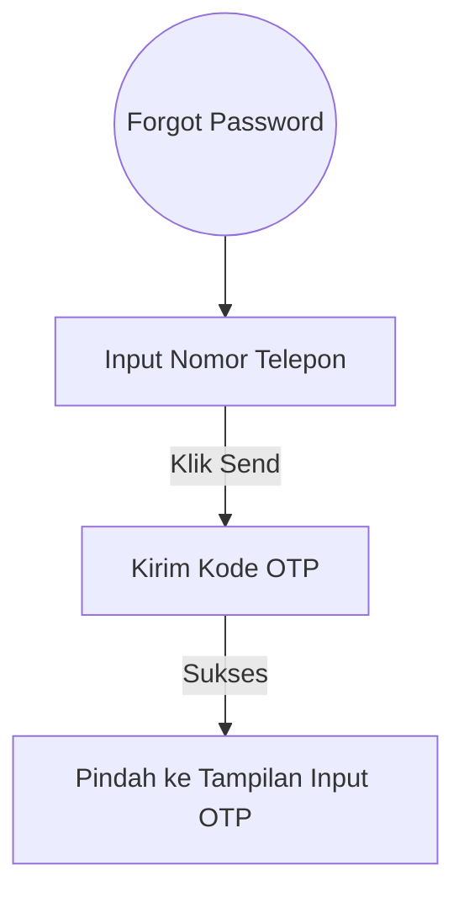
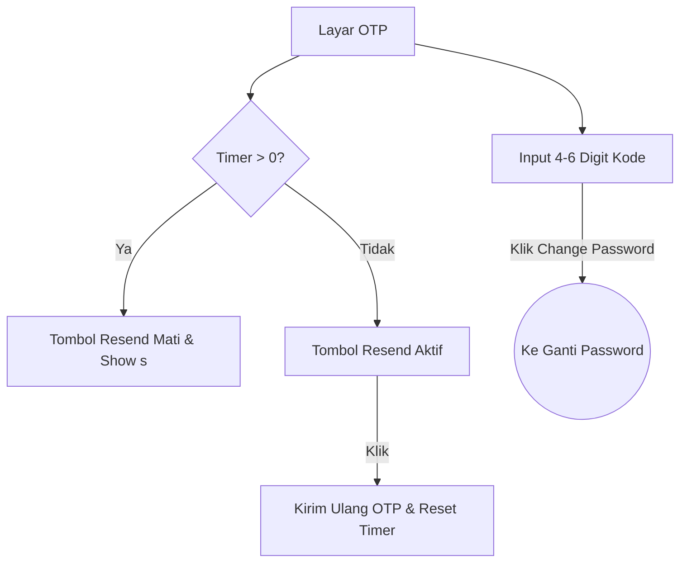
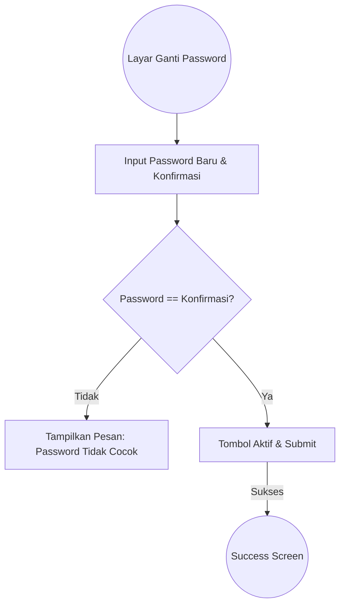

# Dokumentasi Fitur - Forgot Password & OTP Flow

Alur pemulihan akun yang mencakup verifikasi nomor telepon melalui kode OTP.

## 1. Forgot Password (Phone Input)
Pengguna memasukkan nomor telepon untuk menerima kode verifikasi.
* **Diagram Alur**:

## 2. OTP Verification & Resend Timer
Verifikasi identitas pengguna menggunakan kode yang dikirim.
* **Fitur Utama**:
    * **Resend Timer**: Hitung mundur 30 detik sebelum tombol resend aktif kembali.
    * **Auto Focus**: (Opsional) Langsung ke field input.

### Alur Interaksi OTP

## 3. Change Password
Menetapkan kata sandi baru setelah verifikasi sukses.
* **Validasi**: Pengecekan kecocokan (Matching) antara Password Baru dan Konfirmasi Password.

### Alur Validasi Password

