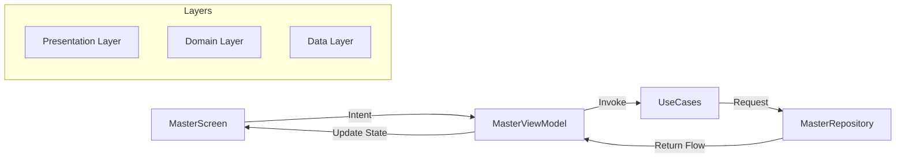
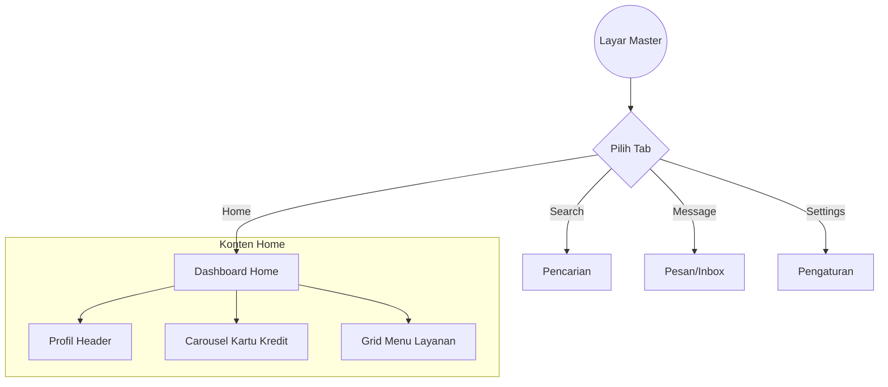

# Dokumentasi Fitur: Master (Home Screen & Dashboard Shell)

## Ringkasan
Fitur **Master** berfungsi sebagai container utama aplikasi setelah pengguna berhasil login. Fitur ini menyajikan ringkasan akun pengguna (Kartu Kredit), akses cepat ke berbagai layanan perbankan melalui grid menu yang adaptif, serta mengelola navigasi Bottom Bar.

Layar ini dirancang untuk memberikan pengalaman "Dashboard Satu Halaman" tanpa scroll (*Zero-Scroll*) dengan interaksi tumpukan kartu vertikal yang modern.

## Arsitektur (MVI + Clean Architecture)
Fitur ini mengikuti pola arsitektur **MVI (Model-View-Intent)** yang terintegrasi dengan **Clean Architecture**:
- **Presentation Layer**: 
    - `MasterViewModel` & `HomeViewModel`: Mengelola state UI menggunakan StateFlow.
    - `MasterState` & `HomeState`: Model data immutable untuk UI.
- **Domain Layer (Pure Kotlin)**:
    - `GetCreditCardsUseCase`: Mengambil daftar kartu kredit.
    - `GetMenuItemsUseCase`: Mengambil daftar menu berdasarkan kartu yang dipilih.
    - `MasterRepository`: Interface kontrak data.
- **Data Layer**:
    - `MasterRepositoryImpl`: Implementasi pengambilan data (saat ini simulasi, siap dihubungkan ke API/Room).

## Komponen Utama & Cara Kerja

### 1. Vertical Card Carousel
Carousel ini menggunakan `VerticalPager` untuk menampung tumpukan kartu kredit.
- **Mekanisme Stacking**: Menggunakan transformasi `graphicsLayer` untuk menciptakan efek "kipas" (*fanned effect*) di bagian bawah kartu utama.
- **Z-Order Management**: Memastikan kartu pertama selalu berada di paling depan menggunakan properti `zIndex` dinamis.
- **Adaptive Scaling**: Tinggi kartu akan otomatis menyesuaikan diri (185dp vs 215dp) berdasarkan deteksi tinggi layar perangkat melalui `BoxWithConstraints`.

### 2. Adaptive Menu Grid
Grid menu yang menampilkan akses cepat ke layanan aplikasi.
- **Smart Limiting**: Hanya menampilkan maksimal 9 item. Jika data dari backend melebihi 9, item terakhir akan otomatis digantikan oleh menu **"More"**.
- **Responsive Distribution**: Menggunakan `Arrangement.SpaceEvenly` untuk mendistribusikan jarak antar menu secara vertikal agar selalu pas di layar 4,5" hingga 7".

### 3. Bottom Navigation
- Menyediakan navigasi Bottom Bar dengan 4 menu: Home, Search, Message, dan Settings.
- Menggunakan `SakaTabBar` dengan animasi transisi yang halus.

## Panduan Pengembang: Menambah Menu Baru

Jika Anda membuat fitur baru (misal: "QR Scanner") dan ingin menampilkannya di Dashboard Master, ikuti langkah-langkah berikut:

### 1. Daftarkan Menu di Repository
Buka `MasterRepositoryImpl.kt` di layer data dan tambahkan item ke dalam list `primaryMenus`:
```kotlin
MasterMenuItem(MenuType.QR, "QR Scanner", "#007AFF")
```

### 2. Definisikan Callback di Screen
Buka `MasterScreen.kt` dan `HomeScreen.kt`, tambahkan parameter callback navigasi:
```kotlin
@Composable
fun MasterScreen(
    onNavigateToQr: () -> Unit, // Tambahkan ini
    // ...
)
```

### 3. Tangani Klik di UI
Di dalam `HomeScreen.kt`, pada bagian `MenuGridSection`, teruskan aksi klik:
```kotlin
MasterMenuGridItem(
    item = item,
    onClick = {
        when(item.type) {
            MenuType.QR -> onNavigateToQr()
            // ...
        }
    }
)
```

## Visualisasi Alur (Clean Architecture Flow)


## Visualisasi Interaksi (Navigation Graph)


## Konfigurasi Visual
- **Horizontal Padding**: Konsisten **16dp** dari tepi perangkat.
- **Spacing**: Jarak antara Carousel dan Menu Grid dikunci pada **8dp-16dp** untuk menjaga kepadatan informasi.
- **Warna**: Menggunakan skema warna `PrimaryBase` (`0xFF2D229E`) untuk header dan `NeutralWhite` untuk kontainer konten.
