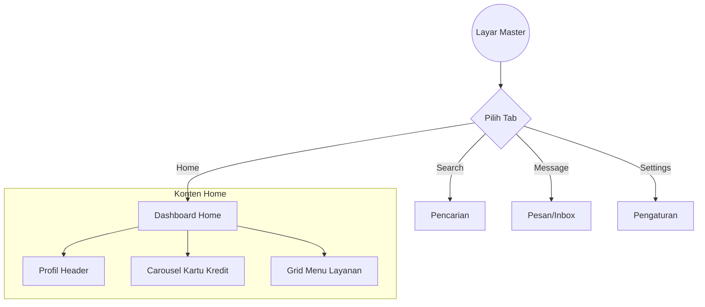

# Dokumentasi Fitur: Master (Home Screen & Dashboard Shell)

## Ringkasan
Fitur **Master** berfungsi sebagai container utama aplikasi setelah pengguna berhasil login. Fitur ini menyajikan ringkasan akun pengguna (Kartu Kredit), akses cepat ke berbagai layanan perbankan melalui grid menu yang adaptif, serta mengelola navigasi Bottom Bar.

Layar ini dirancang untuk memberikan pengalaman "Dashboard Satu Halaman" tanpa scroll (*Zero-Scroll*) dengan interaksi tumpukan kartu vertikal yang modern.

## Arsitektur (MVI)
Fitur ini mengikuti pola arsitektur **MVI (Model-View-Intent)** yang terintegrasi dengan **Clean Architecture**:
- **UI State**: `MasterState` mengelola status navigasi (`selectedTab`), daftar kartu, item menu, dan status interaksi.
- **Intent**: `MasterIntent` menangani aksi pengguna seperti perpindahan tab atau pemilihan kartu.
- **ViewModel**: `MasterViewModel` mengelola logika bisnis dan sinkronisasi data antar komponen.
- **Effect**: `MasterEffect` menangani event satu kali seperti pesan error.

## Komponen Utama & Cara Kerja

### 1. Vertical Card Carousel
Carousel ini menggunakan `VerticalPager` untuk menampung tumpukan kartu kredit.
- **Mekanisme Stacking**: Menggunakan transformasi `graphicsLayer` untuk menciptakan efek "kipas" (*fanned effect*) di bagian bawah kartu utama.
- **Z-Order Management**: Memastikan kartu pertama selalu berada di paling depan menggunakan properti `zIndex` dinamis.
- **Adaptive Scaling**: Tinggi kartu akan otomatis menyesuaikan diri (185dp vs 215dp) berdasarkan deteksi tinggi layar perangkat melalui `BoxWithConstraints`.

### 2. Adaptive Menu Grid
Grid menu yang menampilkan akses cepat ke layanan aplikasi.
- **Smart Limiting**: Hanya menampilkan maksimal 9 item. Jika data dari backend melebihi 9, item terakhir akan otomatis digantikan oleh menu **"More"**.
- **Responsive Distribution**: Menggunakan `Arrangement.SpaceEvenly` untuk mendistribusikan jarak antar menu secara vertikal agar selalu pas di layar 4,5" hingga 7".

### 3. Bottom Navigation
- Menyediakan navigasi Bottom Bar dengan 4 menu: Home, Search, Message, dan Settings.
- Menggunakan `SakaTabBar` dengan animasi transisi yang halus.

## Visualisasi Alur (Interaction Graph)

## Konfigurasi Visual
- **Horizontal Padding**: Konsisten **16dp** dari tepi perangkat.
- **Spacing**: Jarak antara Carousel dan Menu Grid dikunci pada **8dp-16dp** untuk menjaga kepadatan informasi.
- **Warna**: Menggunakan skema warna `PrimaryBase` (`0xFF2D229E`) untuk header dan `NeutralWhite` untuk kontainer konten.

## Panduan Pengembang
Untuk memodifikasi data yang tampil di layar ini, silakan perbarui fungsi `getInitialCards()` dan `getPrimaryMenus()` di dalam `MasterViewModel.kt`. Komponen visual kartu dikelola secara terpusat di modul `:core:ui` sebagai `SakaCreditCard`.
