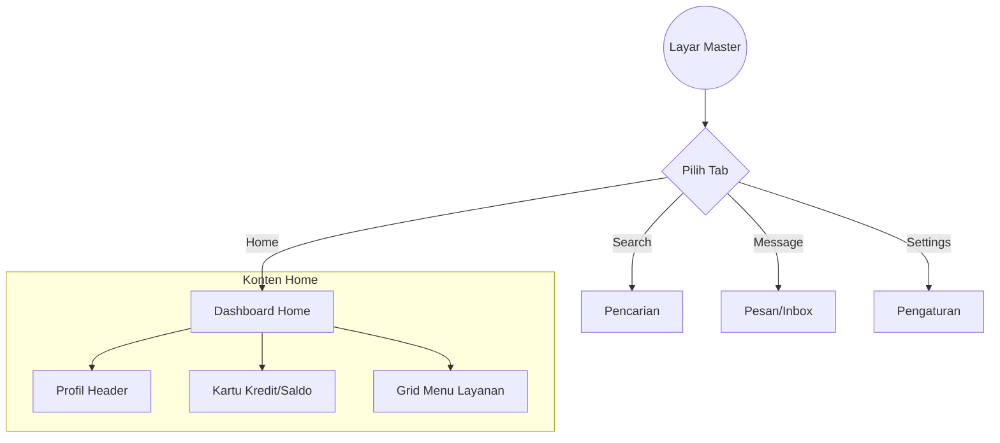

# Dokumentasi Fitur - Master (Dashboard Shell)

Fitur Master berfungsi sebagai container utama aplikasi setelah pengguna berhasil login. Fitur ini mengelola navigasi Bottom Bar dan menampilkan konten dashboard utama.

## Deskripsi Fungsional
* Menyediakan navigasi Bottom Bar dengan 4 menu: Home, Search, Message, dan Settings.
* Menggunakan `SakaTabBar` dengan animasi transisi yang halus.
* Menampilkan dashboard perbankan di menu Home (Informasi Saldo, Kartu Kredit, dan Menu Pintasan).

## Arsitektur UI (MVI)
* **State**: `MasterState` (selectedTab, isLoading).
* **Intent**: `MasterIntent` (SelectTab).
* **Effect**: `MasterEffect` (ShowError).

## Visualisasi Alur (Interaction Graph)

## Komponen UI yang Digunakan
1. **SakaTabBar**: Komponen navigasi bawah kustom.
2. **SakaCard**: Digunakan untuk kontainer kartu kredit dan item menu grid.
3. **SakaAsyncImage**: Untuk memuat foto profil pengguna.
4. **LazyVerticalGrid**: Untuk menampilkan 9 menu layanan di Dashboard.
