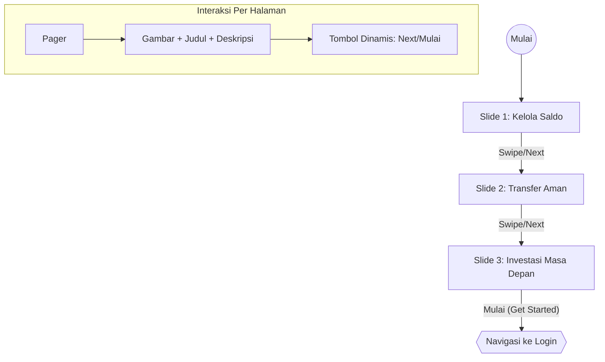

# Dokumentasi Fitur - Onboarding

Fitur ini menangani perkenalan aplikasi kepada pengguna baru melalui serangkaian slide informatif.

## Deskripsi Fungsional
* Menampilkan informasi keunggulan aplikasi.
* Mendukung navigasi swipe manual (HorizontalPager) atau tombol "Next".
* Menyimpan status "Onboarding Completed" (opsional) untuk mencegah pengulangan.

## Arsitektur UI (MVI)
* **State**: `OnboardingState` (items, currentPage, isLastPage).
* **Intent**: `OnboardingIntent` (NextPage, GetStarted).
* **Effect**: `OnboardingEffect` (NavigateToLogin).

## Visualisasi Alur (Interaction Graph)

