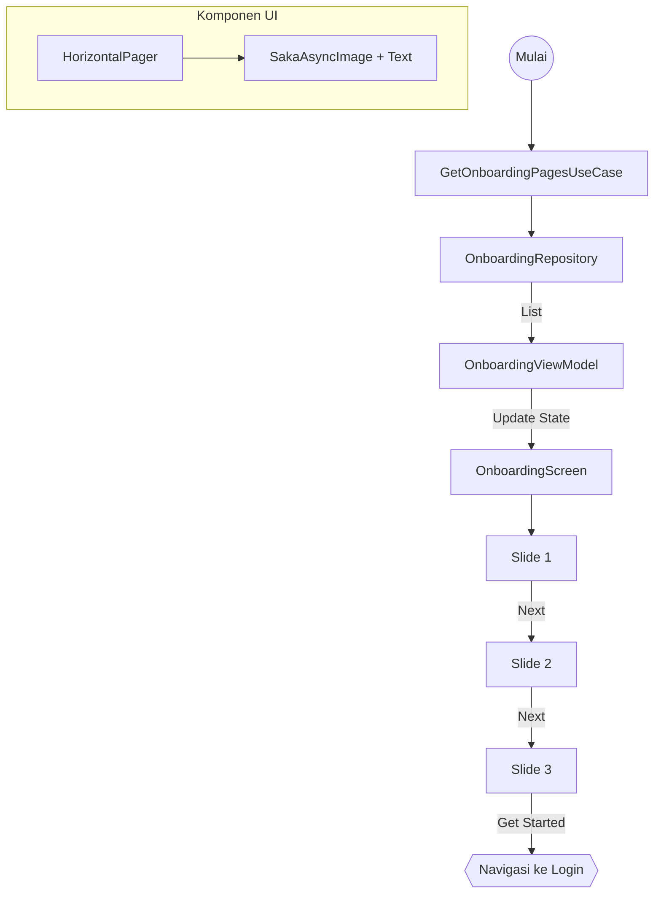

# Dokumentasi Fitur - Onboarding

Fitur ini menangani perkenalan aplikasi kepada pengguna baru melalui serangkaian slide informatif dengan arsitektur yang terdekopel.

## Arsitektur (Clean MVI)
* **UseCase**: `GetOnboardingPagesUseCase` (Mengambil data slide dari repository).
* **State**: `OnboardingState` (items: List<OnboardingPage>, currentPage).
* **ViewModel**: `OnboardingViewModel` (Mengambil data saat init melalui UseCase).

## Deskripsi Fungsional
* Menampilkan informasi keunggulan aplikasi secara dinamis.
* Mendukung navigasi swipe manual (HorizontalPager) atau tombol "Next".
* Menggunakan data model `OnboardingPage` yang didefinisikan di layer domain.

## Visualisasi Alur (Interaction Graph)

## Konfigurasi Data
Data onboarding dapat diubah secara terpusat di `OnboardingRepositoryImpl.kt` tanpa menyentuh layer UI.
