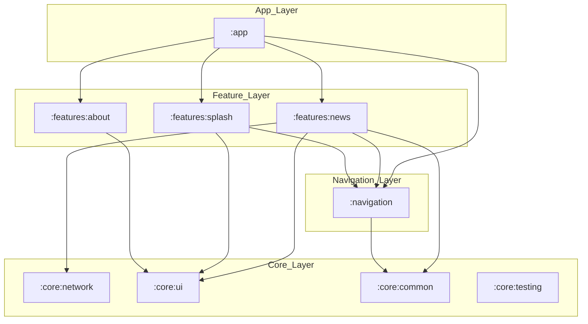

# Clean Architecture & Project Structure

Proyek ini menerapkan **Feature-Oriented Modular Architecture** dengan prinsip **Clean Architecture** di dalam setiap modul fitur.

## 1. Lapisan Arsitektur dalam Modul Fitur

Setiap modul fitur (seperti `:features:news`) dibagi menjadi beberapa lapisan internal:

### Presentation Layer (`ui` package)
- **Tanggung Jawab**: Menampilkan data ke pengguna dan menangani interaksi pengguna.
- **Isi**: Composables (UI), ViewModel, MVI State/Intent/Effect.
- **Teknologi**: Jetpack Compose, Hilt ViewModel, StateFlow.

### Domain Layer (`domain` package)
- **Tanggung Jawab**: Berisi logika bisnis murni yang spesifik untuk fitur tersebut.
- **Isi**: Model Domain, Interface Repository, UseCase.
- **Aturan**: Tidak boleh bergantung pada detail data (Retrofit/Room) atau UI (Compose).

### Data Layer (`data` package)
- **Tanggung Jawab**: Implementasi dari interface repository. Mengelola sumber data (Remote & Local).
- **Isi**: Repository Implementation, DTO, Entity, DAO, Mapper, API Service.
- **Teknologi**: Retrofit, Room, Paging 3.

## 2. Struktur Modul Global

### `:app`
Modul utama yang merakit semua fitur. Berisi `MainActivity`, inisialisasi Hilt global, dan konfigurasi navigasi utama (`AppNavHost`).

### `:features:[name]`
Modul mandiri per fitur (Contoh: `:features:news`, `:features:splash`, `:features:about`). Modul ini bersifat independen namun bisa bergantung pada modul `:navigation` untuk berpindah ke fitur lain.

### `:core:[name]`
Modul infrastruktur yang generic:
- `:core:ui`: Design System aplikasi (Reusable Composables, Theme, Icons).
- `:core:network`: Konfigurasi Retrofit, OkHttp, Interceptor, dan `SafeApiCall` global.
- `:core:common`: Base classes (MVI `BaseViewModel`, `ResultState`, Repository).
- `:core:testing`: Test utilities & Robot Pattern.

### `:navigation`
Modul sentral yang mendefinisikan rute navigasi menggunakan Type-Safe Navigation Compose (Kotlin Serialization). Semua modul fitur bergantung pada modul ini untuk kontrak navigasi.

## 3. Visualisasi Dependensi Modul

## 4. Aliran Data (Dependency Direction)

Arah dependensi selalu mengarah ke yang lebih abstrak:
**UI -> UseCase -> Repository Interface <- Data Implementation**
**Feature -> Navigation -> Core**
