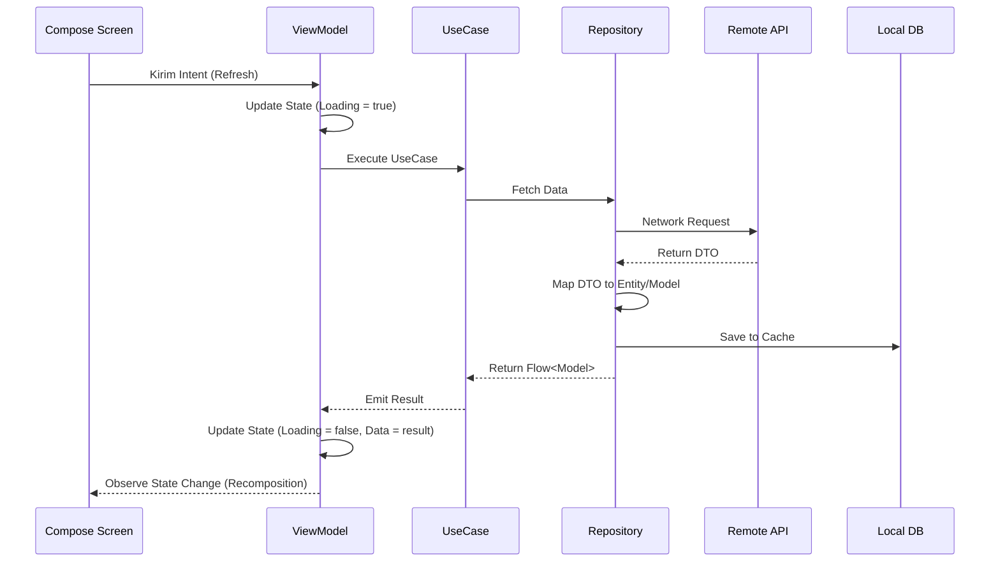

# System Flow & Data Lifecycle

Dokumen ini menjelaskan aliran data dari jaringan hingga sampai ke layar pengguna, serta bagaimana lifecycle komponen dikelola.

## 1. End-to-End Data Flow

---

## 2. Navigasi Antar Fitur
Kami menggunakan **Navigation Handler** yang terpusat untuk menjaga fitur tetap terisolasi.
1. Fitur A ingin pindah ke Fitur B.
2. Fitur A mengirim perintah navigasi melalui `NavigationManager`.
3. `MainActivity` atau `AppNavHost` menangkap perintah tersebut.
4. `NavigationHandler` mengeksekusi navigasi menggunakan `NavController`.

---

## 3. Dependency Injection Flow (Hilt)
- **Singleton Component:** Berada di `:core` (Network, Database).
- **ViewModel Component:** Berada di masing-masing modul `:impl`.
- **Activity Component:** Berada di modul `:app`.

---

## 4. Error Handling Strategy
- Kami menggunakan kelas pembungkus `ResultState<T>` untuk mengirimkan status Sukses atau Error dari Repository ke UI.
- Error di tangkap di lapisan Data/Repository, dipetakan ke pesan yang ramah pengguna, dan dikirim ke UI melalui State atau Effect.

---

## 5. Kesimpulan
Aliran data yang konsisten dan terprediksi mempermudah debugging dan memastikan performa aplikasi tetap terjaga meskipun data yang dikelola sangat besar.
